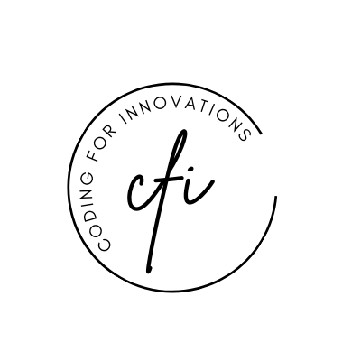

<p align="center">
  <p align="center">
    <a href="https://www.youtube.com/@codingforinnovations" target="_blank">
          
    </a>
  </p>
  <p align="center">
    For Programmers, By Programmers.
  </p>
</p>

# Nextjs + Expressjs

A Standard Next.js App with Express.js on Vercel!

### Youtube Video: [Link](https://www.youtube.com/watch?v=oYO0Hld6bM4)

## 📚 Stack

- [Next Js](https://www.nextjs.org/) - The React  Framework  for the Web.
- [Typescript](https://www.typescriptlang.org/) - JavaScript with syntax for types.
- [Express](https://expressjs.com/)  - Fast, opinionated, minimalist web framework for Node.js.


## 📁 Project structure

```
$PROJECT_ROOT
│  
├── ui  # Nextjs app
│  
├── api # Expressjs 
│  
├── vercel.json  # Vercel config file
```
---

### 🏆 Getting Started:

- Clone Repo

```bash
mkdir nextjs-express
cd nextjs-express
git clone https://github.com/codingforinnovations/nextjs-express .
```
- For Backend

```bash
cd api
pnpm install
pnpm dev
```

- For Frontend

```bash
cd ui
pnpm install
pnpm dev
```
_Open [Backend](http://0.0.0.0:8000)  in : [http://0.0.0.0:8000](http://0.0.0.0:8000)_

_Open [Frontend](http://0.0.0.0:3000)  in : [http://0.0.0.0:3000](http://0.0.0.0:8000)_

## 🎫 LICENSE:

[MIT LICENSE](https://github.com/codingforinnovations/nextjs-express/blob/main/LICENSE) .

## 🆕 Change Log:

[Change Log](https://github.com/codingforinnovations/nextjs-express/commits/main/) .

<div align="center">
<i>Other places you can find us:</i><br>
<a href="https://www.youtube.com/@codingforinnovations" target="_blank"></a>
</div>
